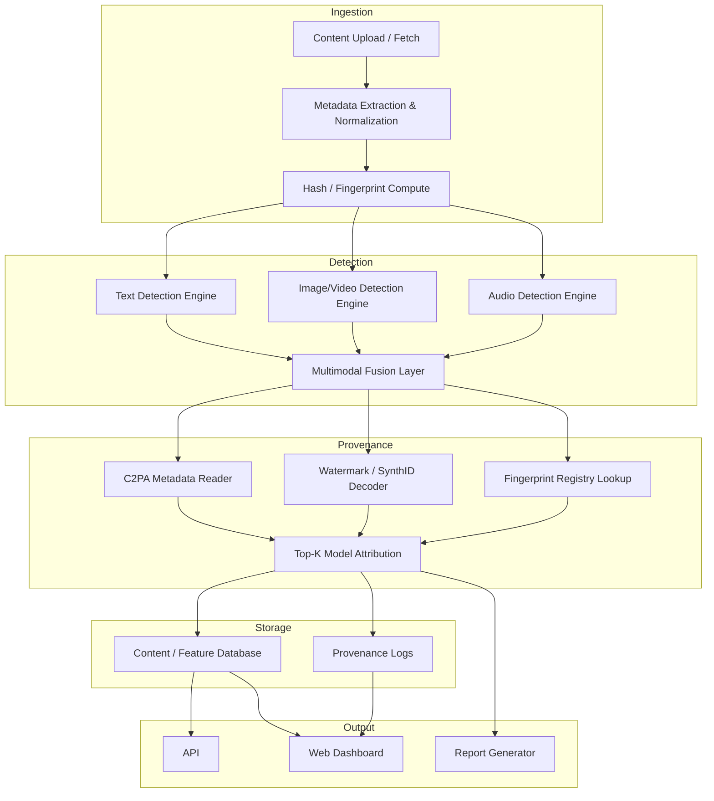

# AGENT.md — AIGC Detection & Attribution System


## 1️⃣ 项目概述

```text
┌─────────────────────────────────────────────────────────────┐
│                 AIGC Detection & Provenance System          │
├─────────────────────────────────────────────────────────────┤
│ 1. Content Ingestion & Preprocessing                        │
│ ─ Accept text, image, audio, video                           │
│ ─ Extract metadata (creation time, format, size)             │
│ ─ Normalize formats, compute hash/fingerprint                │
├─────────────────────────────────────────────────────────────┤
│ 2. Multi-Modal Detection Engine                               │
│ ─ Text Detector (NLP + statistical + PPL + stylometry)       │
│ ─ Image/Video Detector (CNN/ViT + pixel-level artifacts)     │
│ ─ Audio Detector (spectrogram + temporal patterns)           │
│ ─ Small model option: DistilGPT2 / MobileNet / TinyViT       │
├─────────────────────────────────────────────────────────────┤
│ 3. Provenance Analyzer                                        │
│ ─ C2PA Metadata Reader (if content contains credentials)      │
│ ─ Watermark / SynthID Decoder (if embedded)                  │
│ ─ Perceptual hash / registry lookup for known AI content     │
├─────────────────────────────────────────────────────────────┤
│ 4. Model Attribution & Fingerprint Classifier                 │
│ ─ Top-K source model prediction                               │
│ ─ Multi-feature fusion (text: PPL + embeddings;               │
│                       image: pixel/patch stats;              │
│                       audio: spectral features)              │
│ ─ Confidence scoring & explainability output                 │
├─────────────────────────────────────────────────────────────┤
│ 5. Storage & Indexing                                         │
│ ─ Database for content hash, fingerprints, provenance        │
│ ─ Versioning & timestamped logs                               │
│ ─ Support for quick query / similarity search                │
├─────────────────────────────────────────────────────────────┤
│ 6. API & Dashboard                                           │
│ ─ Query content status                                        │
│ ─ Visualize AI probability, Top-K model, provenance chain    │
│ ─ Export reports & alerts                                     │
└─────────────────────────────────────────────────────────────┘


Content Ingestion & Preprocessing
          │
          ▼
  Multi-Modal Detection Engine
   ┌─────────────┬─────────────┬─────────────┐
   │  Text       │ Image/Video │ Audio       │
   │ Detection   │ Detection   │ Detection   │
   └─────────────┴─────────────┴─────────────┘
          │
          ▼
      Fusion Layer (Ensemble / Meta-Classifier)
          │
          ▼
       AI vs Human Score
          │
          ▼
      Provenance & Attribution Layer
   ┌─────────────┬─────────────┬─────────────┐
   │ C2PA / Watermark Decoder │ Fingerprint Registry │ Top-K Model Classifier │
   └─────────────┴─────────────┴─────────────┘
          │
          ▼
     Storage / Index / API / Dashboard
```


**目标**：

- 对多模态内容（文本、图像、视频、音频）进行 AI vs 人类二分类检测
- 对 AI 生成内容进行溯源（Top-K 生成模型预测 + 元数据/水印解析）
- 提供 API 和 Dashboard 方便可视化和交互

**原则**：

- 检测层独立，可直接判断 AI 生成内容
- 溯源层独立，可在检测层基础上预测生成模型
- 多模态检测通过集成 / 融合提高准确率

**整体架构**：



------

## 2️⃣ 模块说明与技术栈

### 2.1 Content Ingestion & Preprocessing

**功能**：

- 接收文本、图像、视频、音频内容
- 提取 metadata（创建时间、格式、大小）
- 标准化内容、计算 hash/fingerprint

**技术**：

- Python：`pandas`, `numpy`, `opencv-python`, `ffmpeg-python`, `librosa`
- Hash / Fingerprint：`imagehash`, perceptual hash, audio embedding
- conda环境叫 dl

------

### 2.2 Multi-Modal Detection Engine

**文本检测**：

- 模型：`AIGC_text_detector` (transformers + PyTorch)
- 方法：NLP + statistical features + PPL + stylometry
- 小模型选项：`DistilGPT2`

**图像 / 视频检测**：

- 模型：CNN / Vision Transformer (`EfficientNetV2`, `TinyViT`)
- 方法：像素级 artifacts 检测 + GAN痕迹分析
- 视频处理：帧提取 + 时序模型

**音频检测**：

- 模型：`YAMNet`, 1D CNN / LSTM
- 方法：Spectrogram + temporal patterns

**融合层**：

- 方法：Late fusion / meta-classifier
- 工具：`torch`, `sklearn`

------

### 2.3 Provenance Analyzer

**C2PA Metadata Reader**：

- 解析嵌入的生成模型、版本、时间戳

**Watermark / SynthID Decoder**：

- 解析内容中隐形水印

**Fingerprint Registry Lookup**：

- 将内容特征与已知模型指纹库匹配

**Top-K Model Attribution**：

- 将文本 / 图像 / 音频 / 视频特征输入分类器，输出可能生成模型 Top-K
- 方法：多模态特征融合 + MLP / LightGBM

------

### 2.4 Storage & Indexing

- 数据库存储：
  - 内容 hash
  - 模型特征 embedding
  - Provenance 记录
- 技术：
  - PostgreSQL / MongoDB + Elasticsearch
  - 时间戳 / 版本管理

------

### 2.5 API & Dashboard

- REST API: 上传内容，返回 AI / Human 判定 + 溯源信息
- Web Dashboard: 可视化概率、Top-K 模型、Provenance chain
- 报告导出: PDF / JSON
- 技术：FastAPI + Streamlit + Plotly

------

## 3️⃣ 数据集与 GitHub 链接

| 模态      | 数据集 / 仓库                        | 链接                                                         |
| --------- | ------------------------------------ | ------------------------------------------------------------ |
| 文本      | AIGC_text_detector dataset           | [GitHub](https://github.com/YuchuanTian/AIGC_text_detector?tab=readme-ov-file) |
| 图像/视频 | IVY-FAKE Benchmark                   | [GitHub](https://github.com/Pi3AI/IvyFake)                   |
| 图像/视频 | AI-Generated-Video-Detector examples | [GitHub](https://github.com/Pranesh-2005/AI-Generated-Video-Detector) |
| 图像/视频 | Awesome-AIGC-Image-Video-Detection   | [GitHub](https://github.com/ant-research/Awesome-AIGC-Image-Video-Detection) |
| 音频      | Audio Deepfake Detection / YAMNet    | [GitHub](https://github.com/topics/audio-deepfake-detection) |

------

## 4️⃣ 项目目录结构（建议 external 分离）

```text
aigc_detection/
├── data/                       # 自己的训练/测试数据
├── external/                   # 第三方开源库源码
│   ├── AIGC_text_detector/
│   ├── IvyFake/
│   ├── AI-Generated-Video-Detector/
│   └── Audio-Deepfake-Detection/
├── ingestion/
├── detection/
├── provenance/
├── storage/
├── api/
├── scripts/
├── requirements.txt
├── config.yaml
└── README.md
```

------

## 5️⃣ 使用说明

1. 安装依赖：

```bash
pip install -r requirements.txt
```

1. 下载数据集：

```bash
# 文本
git clone https://github.com/YuchuanTian/AIGC_text_detector.git external/AIGC_text_detector

# 图像 / 视频
git clone https://github.com/Pi3AI/IvyFake.git external/IvyFake
git clone https://github.com/Pranesh-2005/AI-Generated-Video-Detector.git external/AI-Generated-Video-Detector

# 音频
git clone https://github.com/topics/audio-deepfake-detection external/Audio-Deepfake-Detection
```

1. 训练各模态模型：

```bash
python scripts/train_text.py
python scripts/train_image.py
python scripts/train_audio.py
python scripts/train_video.py
```

1. 融合与推理：

```python
from detection.fusion import FusionClassifier
fusion = FusionClassifier()
score = fusion.fuse({"text":0.7,"image":0.8,"audio":0.5,"video":0.6})
```

1. 溯源：

```python
from provenance.c2pa_reader import read_c2pa_metadata
metadata = read_c2pa_metadata("data/image1.png")
```

1. API / Dashboard：

```bash
streamlit run api/app.py
```

------

这个模板：

- 明确区分了 Detection 层和 Provenance 层
- 采用了 external 文件夹管理第三方库源码，data 文件夹只放你自己的训练/测试数据
- 各模块的技术栈、方法、模型和未来可扩展训练都详细标注
- 包含整体架构 mermaid 图，可直接放到 AGENT.md 内

------

